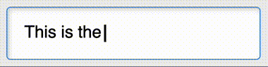

# &lt;typewritten-text&gt; Element

Performs a **typewriter effect** on the selected piece of text!



## Installation

You can import through CDN:

```html
<link rel="stylesheet" href="https://unpkg.com/@auroratide/typewritten-text/lib/style.css" />
<script type="module" src="https://unpkg.com/@auroratide/typewritten-text/lib/define.js"></script>
```

Or, you may install through NPM and include it as part of your build process:

```
$ npm i @auroratide/typewritten-text
```

```js
import '@auroratide/typewritten-text/lib/style.css`
import '@auroratide/typewritten-text/lib/define.js`
```

## Usage

`<typewritten-text>` is an **inline markdown element** that you can use in your HTML document.

```html
<p>Some <typewritten-text>text to type out!</typewritten-text></p>
```

Since this is Just HTML<sup>TM</sup>, you can use `typewritten-text` with other markdown tags:

```html
<p><typewritten-text>Some <strong>strong</strong> and <em>emphasized</em> text.</typewritten-text></p>
```

**Note:** `typewritten-text` has text-level semantics, meaning it can contain anything that a `span` can contain. See [Phrasing Content](https://html.spec.whatwg.org/#phrasing-content-2).

### Repeat Indefinitely

This types and backspaces the text on a loop.

```html
<p>Some <typewritten-text repeat>text to type out!</typewritten-text></p>
```

### Adjust Timing

The time provided is number of milliseconds between each letter.

```html
<p>Some <typewritten-text letter-interval="400">text to type out!</typewritten-text></p>
```

The `phrase-interval` is the time between when the text is typed out and when it starts to be removed during a repetition loop.

```html
<p>Some <typewritten-text repeat phrase-interval="2000">text to type out!</typewritten-text></p>
```

### Start Paused

This will start paused until invoked by **javascript**.

```html
<p>Some <typewritten-text paused>text to type out!</typewritten-text></p>
```

### All Attributes

| Attribute | Default | Description |
| ------------- | --------- | ------------- |
| `repeat` | - | Whether the text should type itself repeatedly on a loop |
| `letter-interval` | 100 | Time between each letter in milliseconds |
| `phrase-interval` | 1000 | Time between completion and restart during a repeat loop in milliseconds |
| `paused` | - | Whether the animation should start paused |

## Style API

Since `typewritten-text` is Just HTML<sup>TM</sup>, you can style it the same way you style any HTML tag.

```css
typewritten-text {
    color: red;
}
```

**Note**: Depending on what you want to do, you may run into some [Implementation Gotchas](#implementation-gotchas).

### Cursor

The blinking cursor can be customized with either CSS variables or directly via selectors.

| Variable | Default | Description |
| ------------- | --------- | ------------- |
| `--typewritten-text_cursor-width` | 0.125em | How wide the cursor is |
| `--typewritten-text_cursor-style` | solid | Whether the cursor is solid, dashed, dotted, etc; can be any border-style value |
| `--typewritten-text_cursor-color` | currentColor | Color of the cursor |
| `--typewriten-text_cursor-interval` | 700ms | The duration of the blink animation |

The cursor can be arbitrarily customized with the following CSS selectors:

```css
.typewritten-text_character::after,
.typewritten-text_start::after { }
```

The `*_start` selector represents the start of the text and can be used to style the initial cursor differently than the cursor-in-motion. For example, to hide the cursor while the animation is paused and yet show it at the start, you can do:

```css
typewritten-text[paused] .typewritten-text_character::after {
    visibility: hidden;
}
```

## Javascript API

The element exposes some useful methods to enable custom animation. Once you have obtained a reference to a `TypewrittenText` element:

```js
const elem = document.querySelector('typewritten-text')
```

You can use the following methods:

| Method | Description |
| ------------- | ------------- |
| `start()` | Start the animation cycle if it is currently paused |
| `pause()` | Pause the animation cycle if it is currently running |
| `typeNext()` | Manually type the next character |
| `backspace()` | Manually remove one character |
| `tick()` | Run one frame of the animation; only works if not paused |
| `forceTick()` | Run one frame of the animation regardless of paused state |
| `reverse()` | Reverse the direction of the animation |
| `reset()` | Completely resets the element and animation; may be useful if the content within the element is dynamic |

### Properties

Each attribute can be accessed as a Javascript property.

* `elem.repeat`
* `elem.paused`
* `elem.letterInterval`
* `elem.phraseInterval`

One additional property is provided:

* `elem.length`: The total number of typeable characters

### Events

The `typewritten-text` element dispatches the following events:

| Name | When Triggered |
| ------------- | ------------- |
| `typewritten-text:nextchar` | Anytime a character is typed into view |
| `typewritten-text:prevchar` | Anytime a character is removed from view |
| `typewritten-text:phrasetyped` | When the full phrase becomes fully typed |
| `typewritten-text:phraseremoved` | When the full phrase becomes untyped |
| `typewritten-text:started` | When the animation is started |
| `typewritten-text:paused` | When the animation is paused |

### Element Class

The element interface can be accessed in javascript as well.

```js
import { TypewrittenText } from '@auroratide/typewritten-text'
```

## Accessibility

This custom element is built with accessibility in mind!

* The `typewritten-text` element always represents its textual content regardless of visibility state. Screenreaders should read the text in its entirety.
* The textual content can be copied and pasted regardless of visibility state.
* The blinking cursor animation is disabled for people who [prefer reduced motion](https://developer.mozilla.org/en-US/docs/Web/CSS/@media/prefers-reduced-motion)

## Implementation Gotchas

It is possible the non-trivial implementation of `typewritten-text` can lead to unexpected complications with advanced customization.

Most notably, `typewritten-text` works by **cloning** its inner content into a separate custom element called `typewritten-text-mirror`, within which each letter is wrapped with a `span` denoted with the class `typewritten-text_character`. The following is an example before-and-after of what the resulting markdown looks like once the element has finished rendering:

```html
<typewritten-text>Hey</typewritten-text>

<!-- ...becomes... -->

<typewritten-text>Hey<typewritten-text-mirror slot="mirror" aria-label="Hey">
    <span class="typewritten-text_character" aria-hidden="true"></span>
    <span class="typewritten-text_character" aria-hidden="true">H</span>
    <span class="typewritten-text_character" aria-hidden="true">e</span>
    <span class="typewritten-text_character" aria-hidden="true">y</span>
</typewritten-text-mirror></typewritten-text>
```

The only part that becomes visible to the viewer is the contents of `typewritten-text-mirror`. As a result, a selector like `typewritten-text > span` will have unexpected results.

This architecture has the following explicit goals:

* Preserve, as much as possible, the way the web developer has specified the usage of the element. This means not overriding the inner content of `typewritten-text`.
* Allow the use of semantic markdown within `typewritten-text` so it acts as much as possible like a native text-level element
* Enable typing each individual character regardless of its formatting, allowing for size- and position-independence.